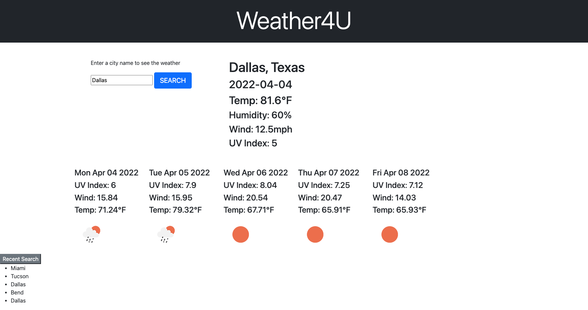

# Jenn-Weather4U

a weather dashboard where you can check the weather from anywere for anywhere 4U!

## Use

Simply type a city of your choice in to the search bar, it will populate the date, temp, uv rating, humidity, and wind speed for that city searched. Then it will also produce a five day forecast for that city with that information and icons to represent the weather

## Challenges

The api provided for class only gave a three day forecast, so I had to go out and find a different one to call seperately and hook it up to the event click. Then I had to decifer the Fahrenheit tailend and figure out how to convert it to the appropriate deg.

With the forcast that had its own set of issues, it was displaying the days as seconds from july 1st 1970, so I had to convert that time into a date using the correct method. 

I was able to do a search history event listener but I couldn't figure out how to loop them back as an event listener when they are generated, but it makes a list, ran out of time to highlight the colors for uv. 

### Screenshot

### Links

[!GitHub](https://github.com/jpcreativeworks/Jenn-Weather4U.git/)
[!LiveLink](https://jpcreativeworks.github.io/Jenn-Weather4U/)